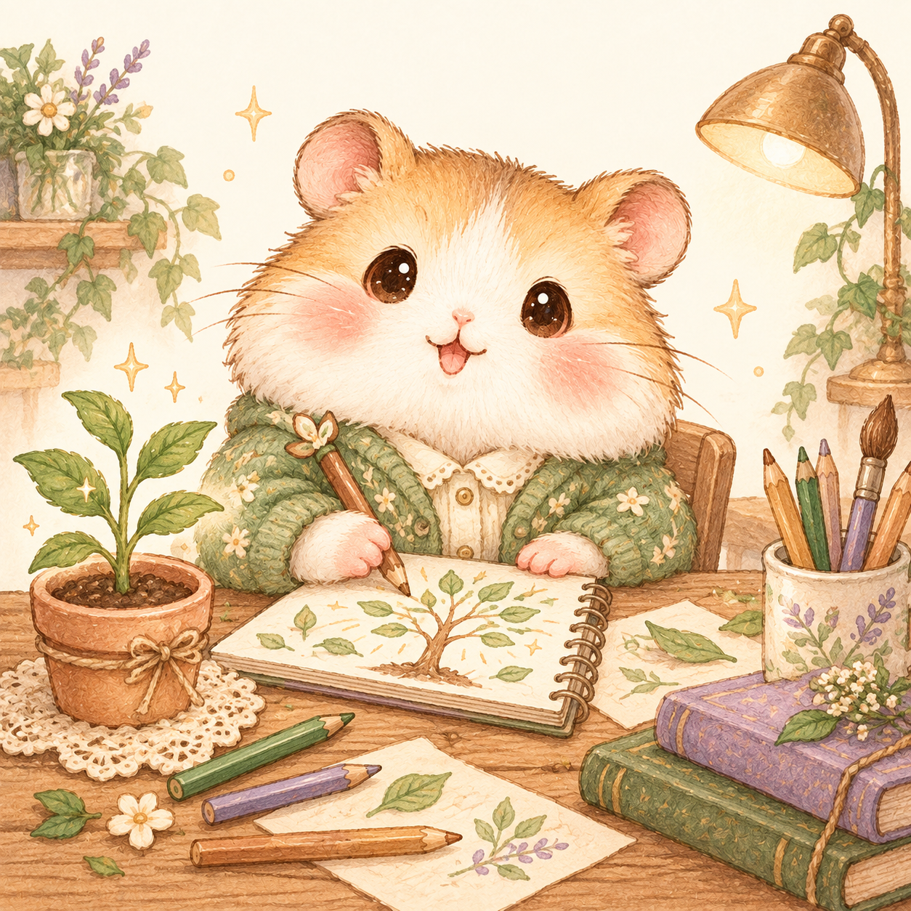
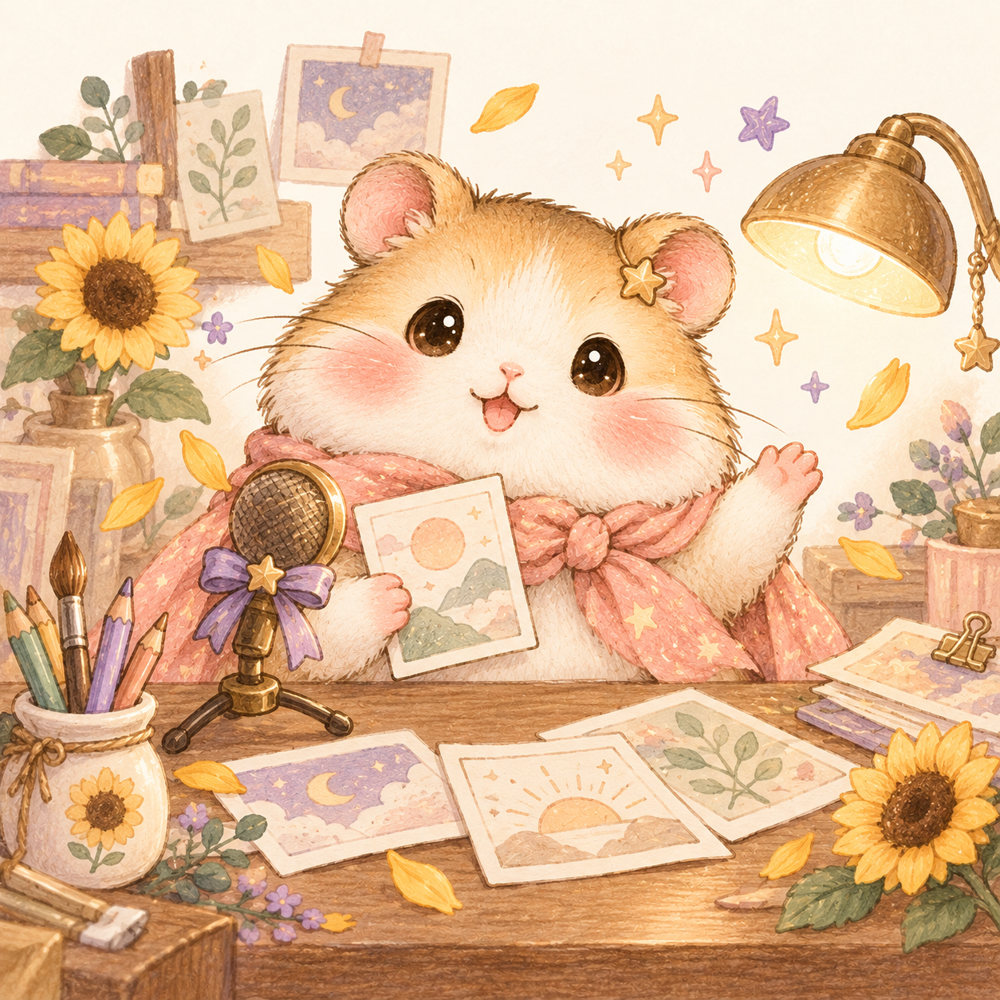
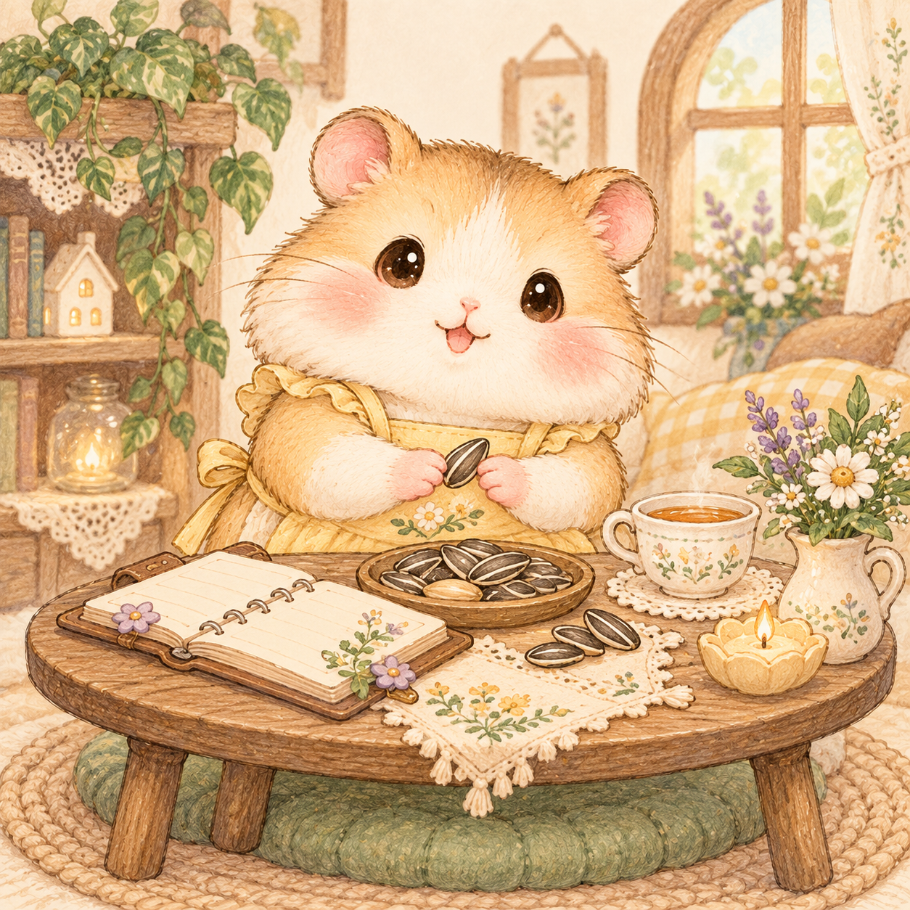
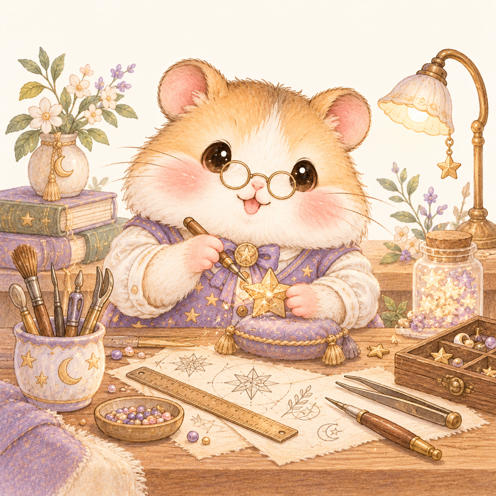
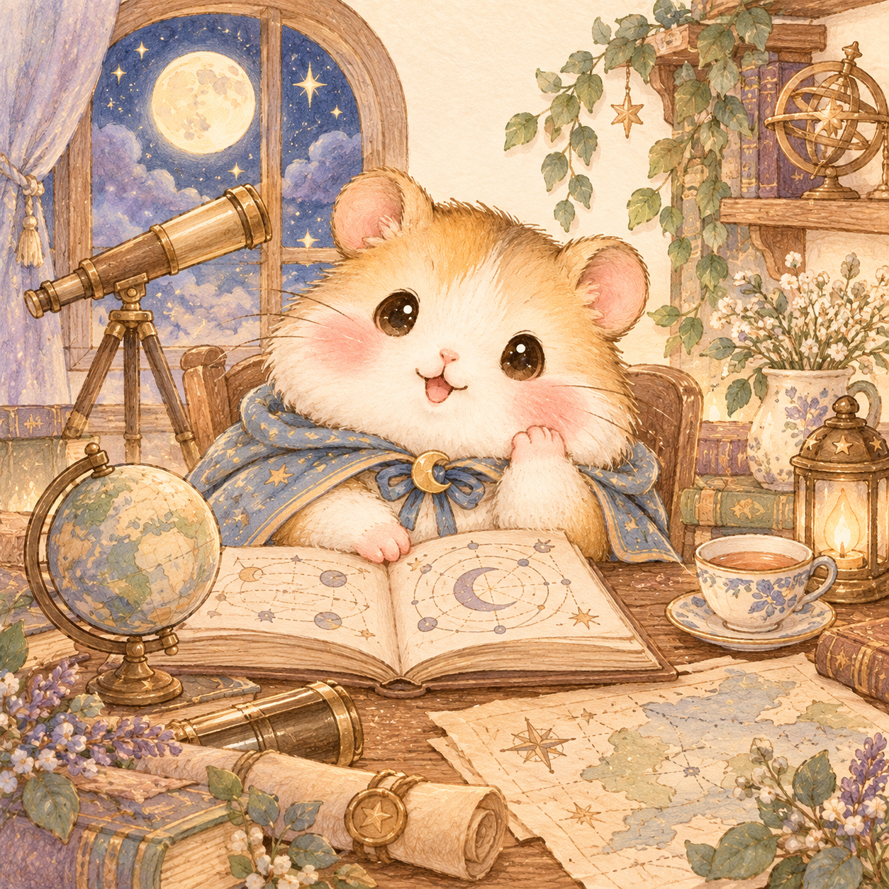

# 몽글사주 캐릭터 삽화

내장 ImageGen으로 생성했습니다. 원본 이미지를 참조한 새 장면이며 기존 햄스터 이미지는 교체하지 않았습니다.

스타일 참조: `../hamster.png`.

## wood.png

원본: C:\Users\cozy0\.codex\generated_images\01a109f2-c6a0-7532-901f-468b1eb4fb4d\exec-04e97240-d542-4522-b162-0a20e4a839ad.png

프롬프트:

> Use case: illustration-story. Asset type: premium saju character report illustration for a Korean hamster fortune teller website. Input image 1 is a STYLE AND CHARACTER reference only, not an edit target. Generate a brand-new illustration of the same adorable round golden-cream hamster, rosy peach cheeks and glossy dark eyes, in this scene: A gentle hamster idea gardener in a sage-green cardigan, sketching a growing project tree in a notebook, a small potted sapling and pencil cups on a wooden studio desk. The scene feels inventive, patient, and hopeful. Style: softly textured colored-pencil and gouache children's book illustration, warm brown hand-drawn outlines, cream, sage, peach, lavender pastel colors, sophisticated Korean stationery aesthetic. Composition: square full little scene, hamster occupies the central 55 percent, head and entire body and small desk visible, leave breathing space on all edges, sparse background details, warm cream paper background. No letters, numbers, readable writing, watermark, logo, UI or borders. The character should look comforting and playful, not childish plastic or photorealistic.

## fire.png

원본: C:\Users\cozy0\.codex\generated_images\01a109f2-c6a0-7532-901f-468b1eb4fb4d\exec-af4ea389-ce8c-4fad-aeec-856a2de7d41f.png

프롬프트:

> Use case: illustration-story. Asset type: premium saju character report illustration for a Korean hamster fortune teller website. Input image 1 is a STYLE AND CHARACTER reference only, not an edit target. Generate a brand-new illustration of the same adorable round golden-cream hamster, rosy peach cheeks and glossy dark eyes, in this scene: A cheerful hamster storyteller wearing a peach-pink scarf, in a tiny warm creative studio, a small microphone, storyboard cards with abstract drawings, a glowing desk lamp and sunflower confetti. Expressive and welcoming, with one tiny gold star hair pin. Style: softly textured colored-pencil and gouache children's book illustration, warm brown hand-drawn outlines, cream, sage, peach, lavender pastel colors, sophisticated Korean stationery aesthetic. Composition: square full little scene, hamster occupies the central 55 percent, head and entire body and small desk visible, leave breathing space on all edges, sparse background details, warm cream paper background. No letters, numbers, readable writing, watermark, logo, UI or borders. The character should look comforting and playful, not childish plastic or photorealistic.

## earth.png

원본: C:\Users\cozy0\.codex\generated_images\01a109f2-c6a0-7532-901f-468b1eb4fb4d\exec-5d7d6cc5-a6c3-4eda-a24c-c32c6acc0865.png

프롬프트:

> Use case: illustration-story. Asset type: premium saju character report illustration for a Korean hamster fortune teller website. Input image 1 is a STYLE AND CHARACTER reference only, not an edit target. Generate a brand-new illustration of the same adorable round golden-cream hamster, rosy peach cheeks and glossy dark eyes, in this scene: A caring hamster studio host wearing a butter-yellow apron, arranging a cozy round worktable with a planner, cups of tea and neatly stacked sunflower seeds. A small plant and warm biscuit-colored room suggest steadiness and care. Style: softly textured colored-pencil and gouache children's book illustration, warm brown hand-drawn outlines, cream, sage, peach, lavender pastel colors, sophisticated Korean stationery aesthetic. Composition: square full little scene, hamster occupies the central 55 percent, head and entire body and small desk visible, leave breathing space on all edges, sparse background details, warm cream paper background. No letters, numbers, readable writing, watermark, logo, UI or borders. The character should look comforting and playful, not childish plastic or photorealistic.

## metal.png

원본: C:\Users\cozy0\.codex\generated_images\01a109f2-c6a0-7532-901f-468b1eb4fb4d\exec-51189415-4107-478e-adc2-8f136c826069.png

프롬프트:

> Use case: illustration-story. Asset type: premium saju character report illustration for a Korean hamster fortune teller website. Input image 1 is a STYLE AND CHARACTER reference only, not an edit target. Generate a brand-new illustration of the same adorable round golden-cream hamster, rosy peach cheeks and glossy dark eyes, in this scene: A meticulous hamster craftsperson wearing a soft lavender waistcoat and tiny round spectacles, refining a little star-shaped ornament at a tidy desk with a ruler, sketches and carefully aligned tools. Thoughtful precision and gentle elegance. Style: softly textured colored-pencil and gouache children's book illustration, warm brown hand-drawn outlines, cream, sage, peach, lavender pastel colors, sophisticated Korean stationery aesthetic. Composition: square full little scene, hamster occupies the central 55 percent, head and entire body and small desk visible, leave breathing space on all edges, sparse background details, warm cream paper background. No letters, numbers, readable writing, watermark, logo, UI or borders. The character should look comforting and playful, not childish plastic or photorealistic.

## water.png

원본: C:\Users\cozy0\.codex\generated_images\01a109f2-c6a0-7532-901f-468b1eb4fb4d\exec-4671d6dc-b9d5-4870-be04-fea2822461ae.png

프롬프트:

> Use case: illustration-story. Asset type: premium saju character report illustration for a Korean hamster fortune teller website. Input image 1 is a STYLE AND CHARACTER reference only, not an edit target. Generate a brand-new illustration of the same adorable round golden-cream hamster, rosy peach cheeks and glossy dark eyes, in this scene: A curious hamster explorer wearing a dusty-blue cape, at a cozy moonlit study desk, reading an open book with abstract diagrams, a tiny globe, a watercolor map, telescope by the window and a cup of tea. Quiet curiosity and imagination. Style: softly textured colored-pencil and gouache children's book illustration, warm brown hand-drawn outlines, cream, sage, peach, lavender pastel colors, sophisticated Korean stationery aesthetic. Composition: square full little scene, hamster occupies the central 55 percent, head and entire body and small desk visible, leave breathing space on all edges, sparse background details, warm cream paper background. No letters, numbers, readable writing, watermark, logo, UI or borders. The character should look comforting and playful, not childish plastic or photorealistic.
